本文记录Carla官方文档中，在UE4里，如何添加四轮车辆与两轮车辆元素<br>
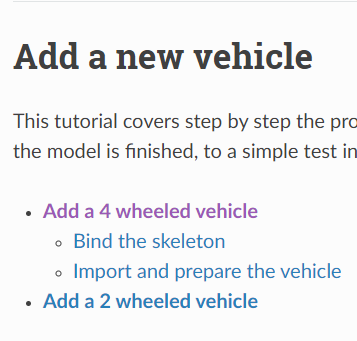
***
### 添加四轮车
#### 1.绑定骨架
***
Carla为我们提供了官方车辆所使用的四轮车参考骨骼。[点此下载骨骼](https://carla-assets.s3.eu-west-3.amazonaws.com/fbx/VehicleSkeleton.rar)
1.1 在3D模型编辑软件中，将车辆模型与骨架分别导入。将骨骼绑定到车辆模型的相应部分，确保**轮子**的骨骼在模型网格内居中。拿3Dmax举例，打开上方工具栏的“图解视图(打开)”，将轮子骨骼进行父子层级关系的绑定。
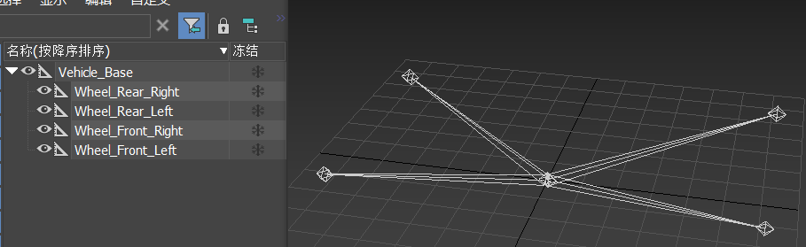
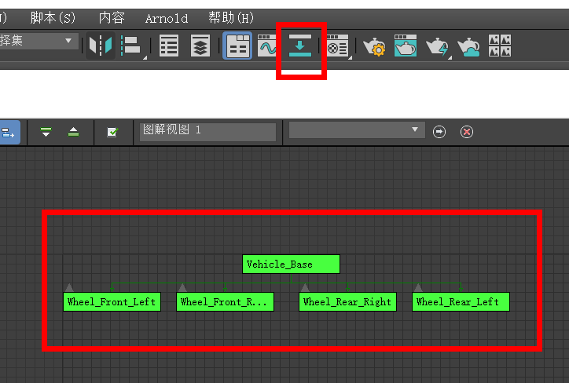<br>
**导出模型需要注意将模型轴向选择‘z轴向上’，与UE4的坐标轴向保持一致**
1.2 骨骼的命名规范如下：<br>
- 左前轮——`Wheel_Front_Left`。
- 右前轮——`Wheel_Front_Right`。
- 左后轮——`Wheel_Rear_Left`。
- 右后轮——`Wheel_Rear_Right`。
- 其余的模型网格——`VehicleBase`。
  PS：请勿添加新骨骼、旋转骨骼、更改骨骼名称或者层次结构，这些操作均会导致骨骼错误。<br>

1.3 选择所有模型网格和骨架，导出为`.fbx`格式。
***
#### 2.准备与导入车辆模型
***
- 1. 在Carla根目录的`Unreal/CarlaUE4/Content/Carla/Static/Vehicle`中创建新文件夹`<vehicle_carName>`。
- 2. 在UE4里，进入到该文件夹中，右键空白处，选择点击导入资源，选中`.fbx`格式的车辆模型。
  - 2.1 —导入内容类型—`Geometry and Skinning Weights`。
  - 2.2 —法线导入方式—`Import Normals`。
  - 2.3 —材质导入方式—（可选）选择`Do not create materials`并取消选中`Import Texture`该选项，防止UE4创建自带的默认材质。
  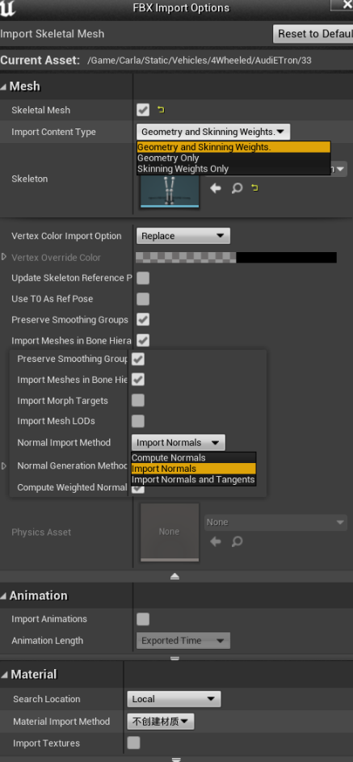
  导入完成之后会出现两个新文件`<vehicle_name>_PhysicsAssets`和`<vehicle_name>_Skeleton`。
- 3. 打开`<vehicle_name>_PhysicsAssets`设置车辆的物理碰撞。
  - 3.1—更改车轮的碰撞体—选择球体并将其大小调整至与车轮相匹配。
  - 3.2—更改轮子的物理类型—每个轮子的物理类型选择为`Kinematic`。
  - 3.3—更改碰撞体类型—选择立方体碰撞，将形状大小调整至与车身相匹配。
  - 3.4为所有碰撞体勾选上`Collision`中的`Simulation Generates Hit Events`。
  
- 4. 创建动画蓝图。并规范动画蓝图的命名：
  - 4.1—Parent Class（父类蓝图设置）—`VehicleAnimInstance`。
  - 4.2—Skeleton（骨骼）—`<vehicle_name>_Skeleton`。
  - 4.3—Rename the bluprint（重命名动画蓝图）—`BP_<vehicle_name>_anim`。
  - 4.4—打开动画蓝图—设置好父类蓝图后，创建`Mesh Space Ref Pose`与`Wheel Handle`节点，连接相应蓝图，完成编译。
  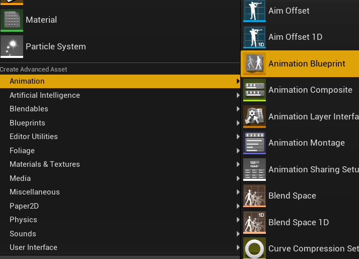
  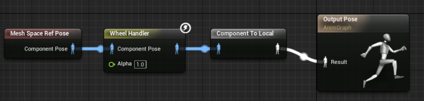
- 5. 创建车轮蓝图，在`Content/Carla/Blueprints/Vehicles`新建一个文件夹`<vehicle_name>`。在其中创建两个蓝图，类型为`VehicleWheel`，分别命名为`<vehicle_name>_FrontWheel` `<vehicle_name>_RearWheel`
  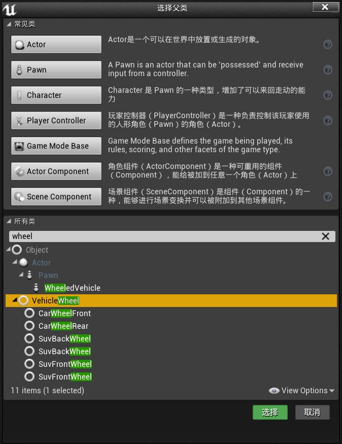
  - 5.1—创建TireConfig数据资源—，并设置摩擦比例FrictionScale。
  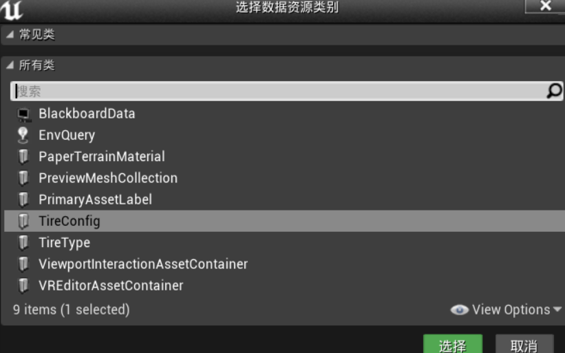
  - 5.2—轮胎配置—`CommonTireConfig`
  - 5.3—前后轮设置—在前轮上，设置`Steer Angle`,默认为`70`。取消选中`Affected by Handbrake`。在后轮上设置`Steer Angle`为`0`。检查`Affected by Handbrake`。
- 6. 为车辆创建`BaseVehiclePawn`蓝图，命名为`BP_<vehicle_name>`。打开蓝图，在`Mesh`中选择车辆的骨骼网格体模型，`Animation`选择上述步骤创建的动画蓝图`BP_<vehicle_name>_anim`。
- 7. 选中左方组件栏中的`Vehicle Movement`，在右方属性栏中搜索`Vehicle Setup`，展开`Wheel setup`，选择相应的前后轮蓝图，并规范命名：
    - —Wheel_Front_Left—对应蓝图`<vehicle_model>_FrontWheel` 。
    - —Wheel_Front_Right—对应蓝图`<vehicle_model>_FrontWheel` 。
    - —Wheel_Rear_Left—对应蓝图`<vehicle_model>_RearWheel` 。
    - —Wheel_Rear_Right—对应蓝图`<vehicle_model>_RearWheel` 。
- 8. 添加车辆。在`Content/Carla/Blueprint/Vehicle`中，打开`VehicleFactory`，将新增的车辆元素添加到该数组中。
    - 8.1—Make—要选择新增车辆在UE4中使用的名称。
    - 8.2—Model—要选择在Carla蓝图库中使用的名称。
    - 8.3—Class—`BP_<vehicle_name>`。
    - 8.4—Recommended Colors—（可选）为车辆提供一组推荐颜色。
    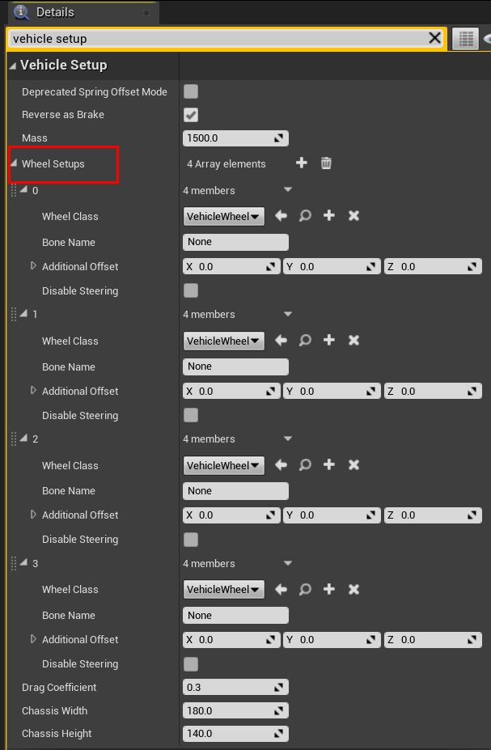
    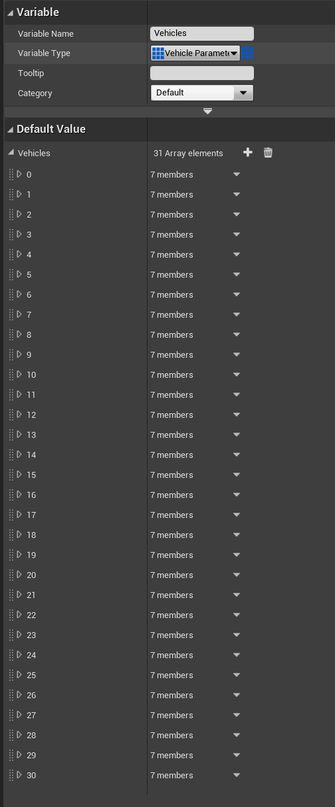
- 9. 测试车辆。启动Carla，并在其中打开终端`Python/examples`，并运行以下命令：
```
python3 manual_control.py --filter <model_name> # The name used in step 8.2 
``` 
***
### 添加两轮车
#### 1.绑定骨架
***
添加两轮车与添加四轮车的步骤基本类似，但由于动画复杂性不同，两轮车需要使用新的骨骼，用以关联驾驶员的动画。[点此下载骨骼](https://carla-assets.s3.eu-west-3.amazonaws.com/fbx/BikeSkeleton.rar)<br>
与四轮车一样，将两轮车模型与骨骼绑定好导出`.fbx`格式时，需要将模型朝正"x"方向，选择z轴朝上。
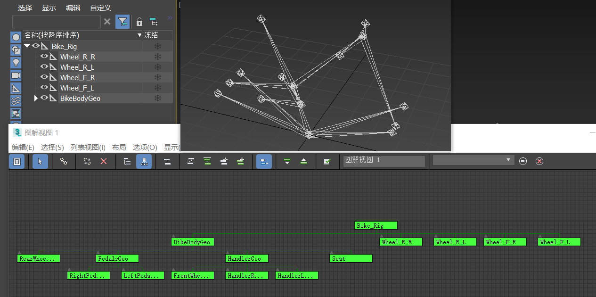
- 1. 在UE4中，将`.fbx`格式的两轮车模型导入文件夹`Content/Carla/Static/Vehicles/2Wheeled`，导入时，选择`General2WheeledVehicleSkeleton`作为骨架。使其自动创建并链接物理资产。
- 2. 打开`Physics asset`，删除自动创建的对象，然后将其添加到`BikeBody`骨骼中，尝试匹配形状。为轮胎创建球形碰撞体，勾选`Collision`中的`Simulation Generates Hit Events`，物理类型设置为`Kinematic`。
- 3. 创建文件夹`Content/Blueprints/Vehicles/<vehicle-model>`。
- 4. 在该文件夹内，为两轮车前后轮创建`VehicleWheel`类蓝图，分别命名为`<vehicle-model>_FrontWheel``<vehicle-model>_RearWheel`。形状**半径**设置为与轮胎半径相匹配的大小。将“轮胎配置”设置为“CommonTireConfig”，*取消选中前轮的“Affected by Handbrake”，后轮的“Steer Angle”设置为0*。
- 5. 创建`Base2WheeledVehicle`的派生类蓝图，命名为`<vehicle_model>`。打开该蓝图，将“Mesh”和“Anim Class”设置为相应组件。随后选择“VehicleBounds”组件，并设置大小以覆盖车辆的区域（从车辆上方看）。
- 6. 选择`VehicleMovement`组件，在`Vehicle Setup`下展开`Wheel Setups`，设置每个车轮的名称与蓝图类。
    - 6.1蓝图类：`<vehicle_model>_FrontWheel`，骨骼名称：`FrontWheel`。
    - 6.2蓝图类：`<vehicle_model>_FrontWheel`，骨骼名称：`FrontWheel`。
    - 6.3蓝图类：`<vehicle_model>_RearWheel`，骨骼名称：`RearWheel`。
    - 6.4蓝图类：`<vehicle_model>_RearWheel`，骨骼名称：`RearWheel`。
    **PS:我们基本上在每块骨头上放了两个轮子。UE4提供的车辆类别不支持车轮数与4不同的车辆，所以我们必须让车辆相信有4个轮子**
- 7. 选择`is bike`变量，如果是自行车模型，勾选该变量会激活脚踏板旋转。如果是摩托车，则无需改动。
- 8. 找到变量`back Rotation`，将其设置为合适，以便更好地对SkeletalMesh进行移动等操作。(步骤7、8的变量在Carla已经定义好的蓝图BP_Base2wheeledNew中)
  
- 9. 对其进行测试，打开CarlaGameMode蓝图，将`Default Pawn Class`更改为新创建的两轮车蓝图。之后运行以下命令：
```
python3 manual_control.py --filter <model_name>
```
  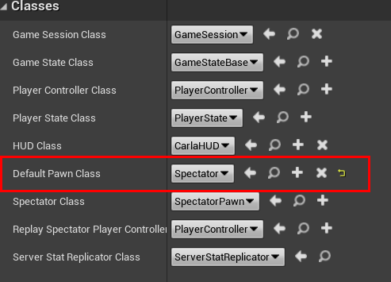
