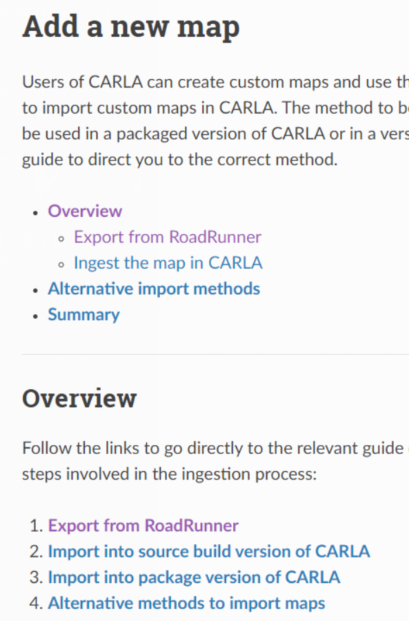
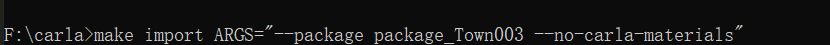
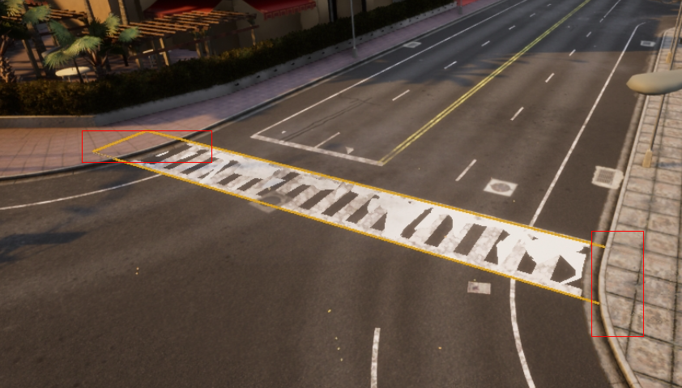
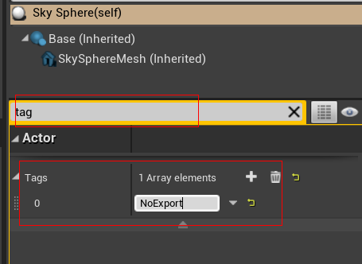
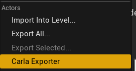
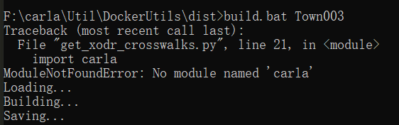
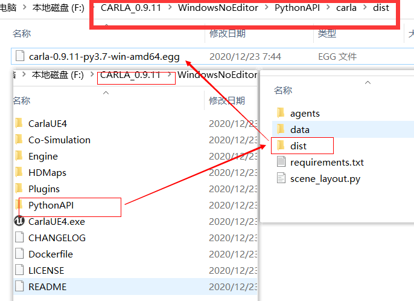
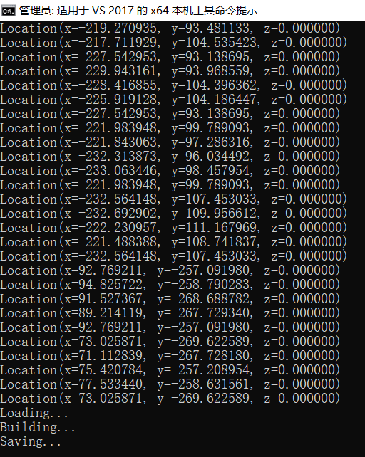
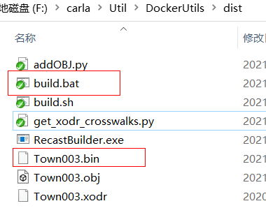

本文记录Carla官方文档中，在Windows上，如何从源代码生成的CARLA中提取地图<br>

- 在导入开始之前，应至少具备两个文件`<mapName>.xodr`和`<mapName>.fbx`。这两个文件可在软件RoadRunner中生成并导出，但这两个文件的值`<mapName>`应该相同，防止被识别为同一映射。<br>
- 可将多个地图提取到同一个文件夹。每个地图应具有唯一的名称。
***
### 1.地图提取
***
- 在CARLA根目录中创建`Import`文件夹，放入要导入其中的地图文件。
- 在**根目录**下运行以下命令以提取文件：
```
make import ARGS="--package <package_name> --no-carla-materials" 
```

#### **PS：可以设置两个参数标志：**
- **使用VS x64本机工具命令提示**
- `--package<package_name>`为包指定名称。默认情况下，包名称设置为`map_package`,该设置会使得软件包的名称相同，但两个相同名称的软件包会导致后续出现提取错误，**故强烈建议更改软件包的名称**
- `--no-carla-materials`指定不想使用的默认CARLA材质。如果**不提供**自己的`.json`文件时，则需要此标志。`.json`文件中的任何值都将覆盖此标志。
***
### 2.自定义地图
***
为了避免自定义地图时，添加的树木、路灯或草地区域之类的元素与行人导航产生冲突，应在生成行人导航前完成自定义，且需要二次生成行人导航。<br>
- 创建新的生成点。这些生成点将用于`spawn_npc.py`脚本中：
    - 在RoadRunner编辑器中，转到`Modes`面板并在`Search Classes`搜索栏中搜索"spawn"。
    - 选择要创建的生成点类型，然后将其拖到地图上。
    - 将生成点防止在地面上方约0.5-1m处，以防与道路碰撞。
- 产生新的人行横道。如果已经定义了人行横道，请避免执行此`.xodr`操作，因为这将导致重复：
    - 创建一个平面网格，该网格在要连接的两个人行道上稍微延伸一些。
    - 将网格防止在与地面重置的位置，并禁用其物理特性和渲染。
    - 将网格重命名为`Road_Crosswalk`或`Roads_Crosswalk`。

***
### 3.生成行人导航 
***  
3.1 防止地图太大无法导出，在UE4引擎中，选择天空球 **Sky_sphere对象**并搜索`tag`，添加标签`NoExport`。如果行人导航中有未涉及到但特别大的网格，也为它们添加`NoExport`标签。<br>
<br>
3.2 仔细检查网格体模型的名称。网格体名称命名需规范，一般规范如下：<br>
>人行道=`Road_Sidewalk`或`Road_Sidewalk`<br>
人行横道=`Road_Crosswalk`或`Roads_Crosswalk`<br>
草=`Road_Grass`或`Roads_Grass`<br>

3.3 `ctrl+A`选择所有内容，然后选择`File`->导出地图`Carla Exprot`。这时，文件`<mapName>.obj`会被创建在CARLA根目录中的`Unreal/CarlaUE4/Saved`。<br>
<br>
3.4 将`<mapName>.obj`和`<mapName>.xodr`移动到`Util/DockerUtils/dist`。<br>
3.5 Windows环境下，运行以下命令以生成导航文件：
```
build.bat<mapName>  #<mapName> has no extension
```
**由于在编译Carla源码过程中，有部分模块会缺失，例如缺失`PythonAPI/dist/carla-0.9.11-py3.7-win-amd64.egg`这一文件，导致出现其他功能无法运行，故需要下载二进制包进行解压，然后将缺失模块导入**<br>
>以下情况为`carla`模块缺失所导致地图导航无法生成的情况<br>
<br>
解决方法：下载Carla二进制压缩包，解压后将`PythonAPI/dist/carla-0.9.11-py3.7-win-amd64.egg`复制到编译好的源码中，重复上述的`build.bat`命令，即可成功生成导航文件。

<br>
上图为生成行人导航的坐标信息
****
<br>
3.6 文件`<mapName>.bin`会被创建。该文件包含了地图上用于行人导航的信息，将该文件移到CARLA根目录下的`Unreal/CarlaUE4/Content/Carla/Maps/nav`中即可。<br>
