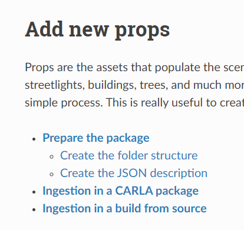
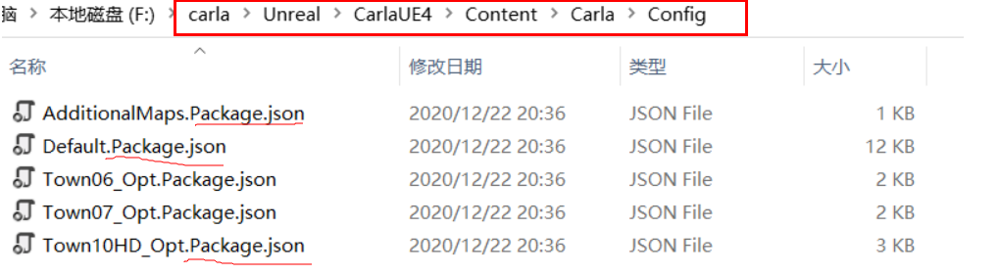

本文记录Carla官方文档中，如何在添加新的道具元素以及相关分类与命名规范。<br>

***
除了地图与车辆以外，剩余的场景资产均属于道具，其中包括路灯、建筑物、树木等。模拟器能够通过一个简单的过程随时提取新的道具元素，这对于在创建自定义地图环境中非常有用。<br>
### 准备包裹
#### 1.创建文件夹结构
***
1.1 在`calra/Import`中创建一个文件夹，文件夹名字便于识别即可，例如`package01`。<br>
1.2 创建它的子文件夹。所有道具元素都应有一个通用的子文件夹，在这个文件夹中，需导入的道具的子文件夹数量也应该相同。<br>
*例如package01文件夹中，含有n个子文件夹，那么，package02文件夹中，也应该有n个名称相同的子文件夹*。<br>
1.3 将每个道具的工程文件移动到相对应的子文件夹中，一个“prop”子文件夹需包含`.fbx`网格模型以及它的纹理贴图。
例如，一个`Import`包含两个单独程序包的文件夹应具有与下面类似的结构。
```
Import
│
├── Package01
│   ├── Package01.json
│   └── Props
│       ├── Prop01
│       │   ├── Prop01_Diff.png
│       │   ├── Prop01_Norm.png
│       │   ├── Prop01_Spec.png
│       │   └── Prop01.fbx
│       └── Prop02
│           └── Prop02.fbx
└── Package02
    ├── Packag02.json
    └── Props
        └── Prop03
            └── Prop03.fbx
```
***
### 2.创建JSON描述
***
在上述包的跟文件夹中，创建一个`.json`文件，以包的名字命名文件。**请注意，这将是发行名称**。该文件的内容将描述一个包含**地图**和**道具**的JSON数组，它包含着每个**地图**和**道具**的基本信息。<br>
**道具**需要以下参数：
- 道具名称。道具的名称必须与`.fbx`模型文件的相同。
- 道具源路径是`.fbx`。
- 对于道具尺寸的估算，在此列出可能的值。
    - `thiy`
    - `small`
    - `medium`
    - `big`
    - `huge`
- 语义细分的标签值。如果标签拼写有错误，它将会被读取为`Unlabeled`
    - `Bridge`
    - `Building`
    - `Dynamic`
    - `Fence`
    - `Ground`
    - `GuardRail`
    - `Other`
    - `Pedestrian`
    - `Pole`
    - `RailTrack`
    - `Road`
    - `RoadLine`
    - `SideWalk`
    - `Sky`
    - `Static`
    - `Terrain`
    - `TrafficLight`
    - `TrafficSign`
    - `Unlabeled`
    - `Vehicles`
    - `Wall`
    - `Water`
- 最后，`.json`文件的内容格式应该与下面的类似。
```
{
  "maps": [
  ],
  "props": [
    {
      "name": "MyProp01",
      "size": "medium",
      "source": "./Props/Prop01/Prop01.fbx",
      "tag": "SemanticSegmentationTag01"
    },
    {
      "name": "MyProp02",
      "size": "small",
      "source": "./Props/Prop02/Prop02.fbx",
      "tag": "SemanticSegmentationTag02"
    }
  ]
}
``` 
**PS:具有相同名称的软件包将会产生错误**
***
### 3.从源代码中生成并摄取
因为直接摄取到Carla包里需要在Docker环境下构建生成，具体操作[点此](https://carla.readthedocs.io/en/latest/tuto_A_add_props/)，下面的内容只介绍从源码中生成和摄取道具文件到carla中。<br>
将JSON文件放到`Ureal/CarlaUE4/Content`中。此外，它将会在`Config`文件夹内创建一个`Package1.package.json`的文件。这将用于在Carla蓝图库中定义道具，并在PythonAPI中公开它们。如果将软件包导出为独立软件包，也将使用它。<br>
准备就绪后，运行以下命令：
```
make import
```
