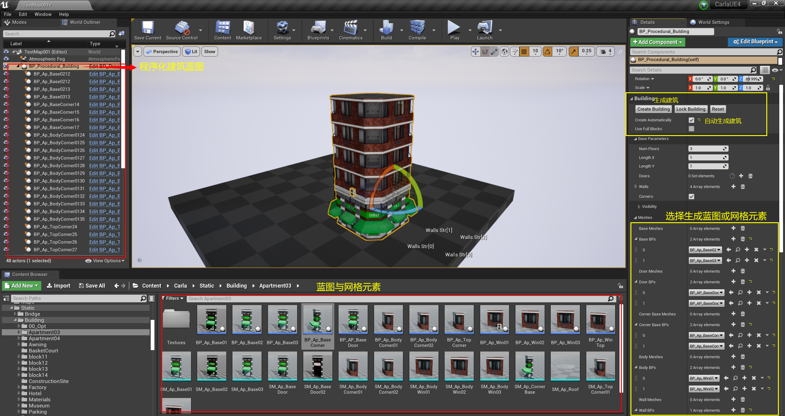
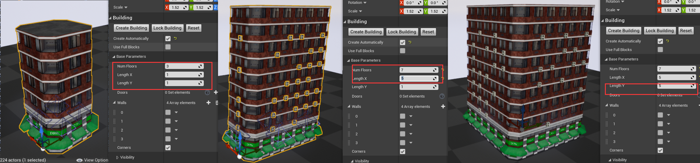
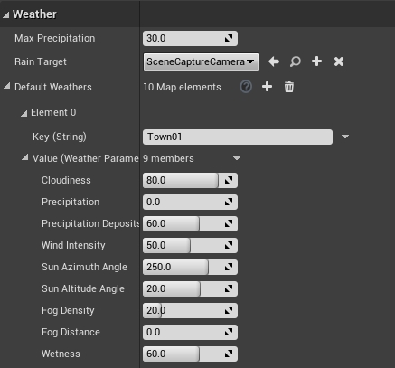

本文记录Carla官方文档中，对他们团队所提供的地图编辑工具的使用方法。这些相关的自定义编辑工具可让用户在UE4中随意编辑地图。 

*本节仅适用于使用源码构建且使用UE4编辑器的用户*
***
### 添加序列网格
***
在`Carla/Blueprints/LevelDesign`中有一系列的蓝图，这些蓝图对于添加**在同一个方向上对齐**的道具非常有用。它们全部使用一系列的网格和贝塞尔曲线来确定放置道具的路径。 
它们之间存在差异，这使得它们适合特定的自定义需求和目的。然而所有的实现方法都是一样的，只有参数化存在差异。
- **初始化序列**。该蓝图需要一个静态网格体，以重复使用。最初，只有一个元素会出现，它位于具有两个节点(起点和终点)的Bezier曲线的起点上。
- **定义路径**。选中一个节点，**按住Alt键不放的同时**拖拽该节点，即可创建一个新的节点并修改曲线。一个新的静态网格体会出现在新生成的节点上，节点之间的空间将被用**距离**度量**分隔的**元素填充。利用每个节点上的权重可调整曲线。
- **自定义模式**。这就是蓝图之间存在差异的地方。
**新增的道具可能会干扰网格导航。如有必要，请在进行以上的蓝图自定义编辑后按照[此处的](https://carla.readthedocs.io/en/latest/tuto_A_add_map/add_map_source/#generate-pedestrian-navigation)说明重新构建网格导航。**
***
#### BP_RepSpline
蓝图**BP_RepSpline**是沿着贝塞尔曲线所定义的路径来添加单个静态网格体元素的。有一些特定的参数可以更改序列化。
- **Distance between Mesh（网格模型之间的距离）**——设置网格元素之间的距离。
- **Offset rotation（偏移旋转）**——为不同的轴设置固定旋转。
- **Random rotation（随机旋转）**——设置不同轴的随机旋转范围。
- **Offset translation（偏移平移）**——沿不同的轴设置随机位置范围。
- **Max Number of Meshes（最大网格模型数）**——设置放在曲线节点之间的网格模型最大数量。
- **World aligned ZY（世界对齐ZY轴）**——如果选中此选项，网格元素将与世界轴垂直对齐。
- **EndPoint（结束端点）**——如果选中此选项，将在曲线的结束节点中添加网格元素。
- **Collison enabled（启用碰撞）**——设置为网格启用的碰撞类型。
 
#### BP_Spline
蓝图**BP_Spline严格**按照贝塞尔曲线定义的路径添加**连接的**网格元素，与**BP_Spline**不同的是，此蓝图会将网格体进行扭曲变形处理，以适应路径并创建。
- **Gap Distance**——在网格元素之间添加距离间隔。
 
#### BP_Wall
蓝图**BP_Wall**是沿着贝塞尔曲线定义的路径添加**连接的**网格元素。网格元素不会扭曲变形以适应曲线，但节点会被尊重。
- **Distance between**——设置网格元素之间的距离。
- **Vertically aligned（垂直对齐）**——如果选中，则网格元素相对于世界轴垂直对齐。
- **Scale offset（缩放偏移）**——缩放网格元素的长度使得元素之间的接缝变得圆滑。
**PS：0.9.11版本的Carla所提供的BP_Wall里没有distance between这一属性，且不同模型的连接效果会有所区别。**

#### BP_SplinePowerLine
蓝图**BP_SplinePowerLine**是沿着贝塞尔预先定义的路径添加**电线杆，并将其与电源线相连接**。 
在`Carla/Static/Pole`里，可以找到该蓝图。该蓝图允许设置需要重复的网格元素阵列，以提供多样性。 
*可以对连接电线杆网格元素的电源线进行自定义编辑。*
- **选择**将用作导线的**网格元素**。
- **tension（张力）**。如果该值为0，则电源线保持水平。该值越大，电源线越松弛并下坠。

- **设置插槽**。在电线杆网格元素中，为其添加插槽节点，并命名为`Scoket`。插槽为空的网格元素，表示电源线连接点，可以自定义插槽的数量和位置。

PS:电线杆两端的插槽数量与名称应成对称分布，单数命名为一边，双数命名为另一边，否则会出现可视化错误。

***
### 程序化建筑
蓝图**BP_Procedural_Building**位于`Content/Carla/Blueprints/LevelDesign`中。它使用沿着结构重复的关键网格，创建出一个真实的建筑物。对于每一个网格，用户都可以提供一个网格数组，这些网格将随机用于各个不同的网格，加以组合变化。网格仅创建一次，重复使用的将是它们的实例，这样可以节约资源空间。 
>蓝图用来代替网格，以便为建筑物提供更多的自定义类别。蓝图可以使用行为树来设置建筑物内的照明、更改使用的材质等。

#### 建筑结构
在使用程序化建筑蓝图生成建筑时，任何对其的改动都会使关键网格进行更行，届时建筑物会消失，可点击`Create Building`重新生成建筑或者启用`Create automatically`，让其自动生成建筑。 
可将这些建筑物的关键网格元素看作是整体结构的一部分，它们可以拆分成四个类别：
- **Base**——建筑物的底楼。
- **Body**——建筑物的中层。
- **Top**——建筑物的顶层。
- **Roof**——用于填充顶层中空部分的网格元素，可看作顶层的地面。
对于每个建筑物的屋顶，除了**Roof**以外，都有一个网格元素用以填充地板的中心，还有一个**Corner**网格将放置在地板的侧面，下图展示建筑物的全局结构。

Tips：
    * BP_Pricedural_Building在使用过程中，可在细节面板里`Meshes`添加它的网格元素或蓝图，点击生成建筑后，会生成相对应的网格/蓝图。
    * 虽然蓝图和网格元素可随意选择搭配，建议蓝图和蓝图搭配或者网格和网格搭配，以节省运行内存。
    * 使用蓝图用以生成建筑物可以有更多的自定义编辑操作。

##### 建筑物的基本参数与尺寸设置如下：
- **Num Floors**——建筑物的楼层数量。原理是将`Body`网格元素重复生成。
- **Length X and Length Y**——建筑物的面积。原理是将建筑物每一侧的中央网格元素重复生成。

#### 结构修改
还有一些其他选项可以修改建筑物的总体结构。
- **Disable corners（禁用角）**——如果选择，则不使用任何`Corners`网格元素。
- **Use full blocks（使用完整的块）**——如果选中，建筑物的结构将仅在每个楼层使用一个网格元素，每层楼都不会再出现`Corners`或重复的网格元素。
- **Doors**——出现在`Base`的网格元素，位于中心网格的正前方。可以设置地板的数量及位置。`0`是初始位置，`1`是下一个重复，以此类推。
- **Walls**——替代建筑物一个或多个侧面的网格元素。例如，可以使用平面网格绘制建筑物的一侧。
**效果预览：**

***
### 天气定制
用户可以使用PythonAPI在Carla中轻松自定义天气。但是，为了设置地图默认的天气，用户还可以进行一些参数配置。以下蓝图中可供配置的天气参数与API中的相同。具体描述[在此处](https://carla.readthedocs.io/en/latest/python_api/#carlaweatherparameters)。
#### BP_Weather
模拟开始时，此蓝图将加载到世界中。它包含每个地图的默认天气参数，可以随意修改。
1. 在`Content/Carla/Blueprints/Weather`中**打开BP_Weather**。
1. 转到蓝图里的**Weather**中。
1. 选择所需的关卡，输入名称并修改参数。

#### BP_Sky
该蓝图将所有天气参数分组。可以在没有Carla服务器运行时将其加载到场景中，并用于在设置新的默认天气之前，测试不同的配置。
1. 在`Content/Carla/Blueprints/Weather`中找到**BP_Sky**。
1. 将蓝图加载到场景中，将其拖动到场景视图中。
1. 编辑天气参数，场景中的参数将相应地更新。
PS:如果将一个以上的蓝图加载到场景中，那么天气将被复制，并产生奇怪的结果，例如，有两个太阳。