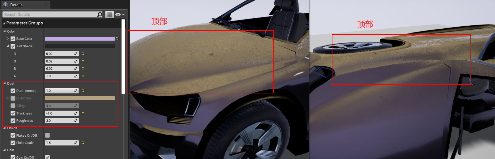
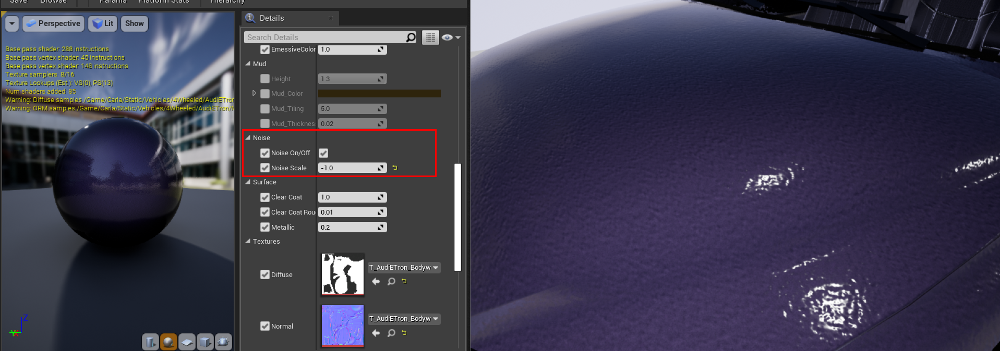
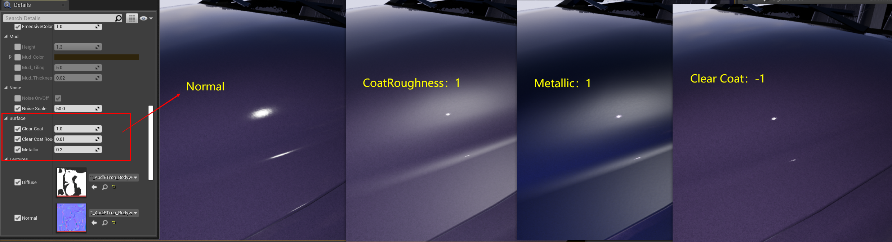

本文记录Carla官方文档中，Carla提供的材质如何使用修改，已达自己的效果需求。*适用于使用源码编译和构建，且使用UE4编辑器的用户* 

### 汽车材质
***
在Carla中，车辆的母材质位于`Content/Carla/Static/GenericMaterials/Vehicles`，它是车辆各部分材质的模板，使用时创建其材质实例，赋给车辆网格模型即可。官方母材质展示如下：

- M_CarExterior_Master——应用于汽车车身的材质。
- M_CarInterior_Master——应用于汽车内部的材质。
- M_CarLightsGlass_Master——应用于车灯玻璃灯罩的材质。
- M_CarWindows_Master——应用于窗口的材质。
- M_CarLicensePlate_Master——应用于车牌的材质。
- M_CarVehicleLights_Master——应用于车灯光束的材质。
- M_CarVehicleLightsSirens_Master——应用于警报器的材质。
***
### 定制汽车材质
***
创建母材质的材质实例，命名`MI_property_component`，将其移动到所导入的新模型的文件夹中。
 
所有的材质都可以在很大程度上进行修改，但只有外部材质具有一些值得一提的特性。另一些材质具有某些可以更改的属性，例如玻璃材质中的不透明度和颜色，但除了特殊需求以外，一般不建议修改这些参数。
 
#### 外观特性
外部材质应用于汽车车身，一般指车漆部分，车身的纹理、颜色、阴影、反光等属性均可进行修改，因而车身材质是可修改度最高的一种材质。
- **底色**——车身的基调颜色。
- **色调阴影**——随可视角度而变化的可视性色调。
 
*左图为关闭色调阴影的效果，右图为开启红色色调阴影的效果*
- **灰尘**——应用于汽车表面的污垢纹理。污垢纹理只堆积在几何形状的**顶部表面**位置，不因物体进行旋转而改变堆积位置。
    - `Amout`——纹理的不透明度。 
    - `Color`——灰尘纹理的基色。 
    - `Tiling`——纹理图案的大小与重复度。 
    - `Thickness`——纹理密度。 
    - `Roughness`——减少由于灰尘引起的汽车金属反射。
   
- **亮片**——金属车漆上的亮片效果。
    - `On/Off`——启用和禁用该功能。
    - `Scale`——亮片大小。
    - `Brightness`——亮片发光强度。
    - `Color`——亮片基色。
 
- **增益**——汽车底漆的噪声增益。
    - `On/Off`——启用和禁用该功能。
    - `Scale`——增益效果大小。
    - `Color`——增益基色。 
 
- **泥垢**——应用于汽车的泥垢纹理。泥垢的出现位置是从汽车的底部到顶部。
    - `Height`——泥垢出现在车身部分的高度位置。
    - `Mud_Color`——泥垢纹理的基色。
    - `Mud_Tiling`——泥垢纹理图案的大小与重复度。
    - `Mud_Thickness`——泥垢纹理密度。 
 
- **噪波**——应用于材质法线强度的噪波，产生橘皮效果
    - `On/Off`——启用和禁用该功能。
    -  `Scale`——法线贴图的凹凸度大小。
 
- **表面**——车漆表面的光泽与透明涂层。
    - `ClearCoat`——涂层的不透明度。
    - `ClearCoat_Brightness`——表面材质的光泽度。
    - `ClearCoat_Metallic`——结果材质的反射度。 
 
***
### 建筑材质
***
在建筑物上所应用的材质由以下四种基本的纹理组成：
- **漫反射** ——包含材质的基本颜色通道。
    - `RGB`——基础颜色的三个通道。
    - `Alpha`——该通道定义了一个遮罩，遮罩允许修改白色部分的颜色。这对于从相同材质所创建的一些变体材质非常有用。
- **ORME**——使用特定通道映射出材质的不同属性。
    - `Ambient occlusion`——包含在`R`通道中。
    - `Roughness`——包含在`G`通道中。  
    - `Metallic map`——包含在`B`通道中。  
    - `Emissive mask`——包含在`Alpha`通道中。该遮罩允许更改白色部分的颜色和强度。
- **法线**——包含材质的法线贴图。
    - `RGB`——法线地图信息。
- **自发光**——如果适用，该纹理用于设置纹理的发光颜色。
    - `RGB`——纹理中发光元素的颜色信息。
***
### 定制建筑材质
***
建筑材质与汽车材质大同小异，如果需要，可以极大地对Carla提供的建筑材质进行改变。不过，需要对建筑物所使用的两种自定义着色器进行一些自定义编辑。
- **Glass Shader**——`M_CarWindows_Master`。
    - `Opacity`——在“漫反射”`Alpha`纹理的白色区域启用颜色更改。
    - `Color`——基于“漫反射”`Alpha`纹理上的白色区域应用的色调。
- **Building Shader**——`M_Building_Master`
    - `Change Color`——在“漫反射”`Alpha`纹理的白色区域启用颜色更改。
    - `Color`——基于“漫反射”`Alpha`纹理上的白色区域应用的色调。
    - `Emissive Texture`——启用“漫反射”贴图的使用。
    - `EmissiveColor`——基于“ORME”`Emissive mask`纹理上的白色区域应用的色调。
    - `Emissive atenuance`——将“BP_Lights”中所**指定**的强度分开，以获得适当的发射值得因子。
    - `RoughnessCorrection`——更改粗糙度贴图的强度。
    - `MetallicCorrection`——更改金属贴图的强度。
    - `NormalFlatness`——更改法线贴图的强度。
***
### 定制道路
**RoadPainter**是使用OpenDRIVE信息绘制道路的工具。要做到这一点，需要使用蓝图，它使用主材质、道路的渲染目标作为画布，以及额外的贴花和网格。主材质是将被用于在蓝图中的材质收集，使用笔刷来混合它们的应用。 
这是一种简单的方式来彻底改变外观的道路。道路的初始几何图形就像画布一样被绘制。不需要应用测光技术，也不需要考虑几何体的UV。只需混合纹理和创建遮罩即可获得效果。 
#### 创建材质组
首先，创建一个材料组，这其中包含道路涂装材质的实例。
1. **创建材质实例**。在`Game/Carla/Static/GenericMaterials/RoadPainterMaterials`中找到`RoadMaster`并创建其材质实例。
1. **设置`RenderTarget`**。为正在使用的路线图创建渲染目标[(具体创建方法)](https://docs.unrealengine.com/en-US/RenderingAndGraphics/RenderTargets/BlueprintRenderTargets/HowTo/CreatingTextures/index.html)。在`Texture Parameter Values`启用`Texture mask`并添加纹理。
1. **设置地图大小**。在材质实例中`Scale Parameter Values`里，设置`Map units(cm)`的大小，如果没有明确的地图大小数值，可以取个临时值代替，地图的实际大小可在后续中使用蓝图检索。
1. **选择要应用的材质**。在一个基础材质空间中，另外三个材质将用于在基础材质上进行绘制。绘制信息将存储在`RenderTarget`的RGB通道中，每种材质一个通道。并将他们添加为`Base Material`,`Material 1`,`Material 2`和`Material 3`。
 
#### 改变道路外观
在UE4中，利用Carla提供的蓝图对道路的外观进行改变。蓝图将使用传递进去的材质以及一些笔刷设置来完成道路的绘制。此外，还可以添加贴花和网格模型，以便最终结果呈现得更加详细。该工具考虑道路信息，并将使用车道得方向绘制元素，除非声明了偏移量。 
> 该工具不会干扰改变对道路外观得天气设置，例如潮湿或降雨。

1. **创建RoadPainter蓝图的实例**。可以在`Carla/Blueprints/LevelDesign`中找到它。该蓝图决定了道路如何被粉刷，以及如何使用`RoadMaster`中的材质。
1. **设置`RenderTarget`和`Map size`**。在`Paint`类中，这些**设置**必须与`RoadMaster`材质中的相同。
  
>`Default`中的`Z-size`选项将为您提供地图的准确大小。以及，需要确保蓝图和母材质所具有的值相同。

3. **应用材质组**。选择所有道路网格并应用该材质实例。
4. **对每种材质，设置需要使用的刷子**。`GenericMaterials/RoadStencil/Alphas`中提供了不同的笔刷，使用此处所述的笔刷和参数，在道路网格上绘制材质。
- `Stencil size`——笔刷大小。
- `Brush strength`——笔刷强度。
- `Spacebeween Brushes`——笔刷间距。
- `Max Jitter`——笔触间的大小抖动变化。
- `Stencil`——要使用的笔刷。
- `Rotation`——笔划的旋转。
  
  
5. **不同材质应应用到道路的不同部分**。在`RoadPaint`蓝图中的`Default`里，有一系列选项可以选择如何应该材质。
- `Paint all road`——将笔刷应用到所有道路上。
- `Paint by actor`——绘制选定的特定角色。
- `Paint over circle`——使用圆形图案绘制，有助于提供变化。
- `Paint over square`——使用方形图案绘制，有助于提供变化。
本节还包括用于擦除已应用更改的选项。
- `Clear`——擦除蓝图上所有的绘制。
- `Clear material`——删除当前处于活动状态的材质。
- `Clear material by actor`——删除最接近所选角色的材质。
 
##### PS:稍微地洞编辑器视图，使得所做的更改可见。
6. **添加贴花和网格**。将元素添加到相应的数组中，并设置和调节一些基本参数，以了解如何在道路上生成它们。
- `Decal/Mesh Scale`——贴花/网格在每个轴上的比例。
- `Fixed Decal/Mesh Offset`——每个轴与车道中心的偏离。
- `Decal/Mesh Random Offset`——每个轴与车道中心的最大偏差。
- `Decal/Mesh Random Yaw`——最大随机偏航旋转。
- `Decal/Mesh Min Scale`——应用于贴花/网格的最小随机比例。
- `Decal/Mesh Max Scale`——应用于贴花/网格的最大随机比例。
 
7. **生成贴花与网格**。使用按钮`Spawn decals`和`Spawn meshes`。
8. **测试运行**。大胆尝试不同的参数设置、材质和笔刷，以获得各不相同的结果。此工具允许通过更改材质组和更新一些设置来为道路外观创建出不同的预设，并在它们之间进行更改，展现不一样的效果。 
#### 效果示例