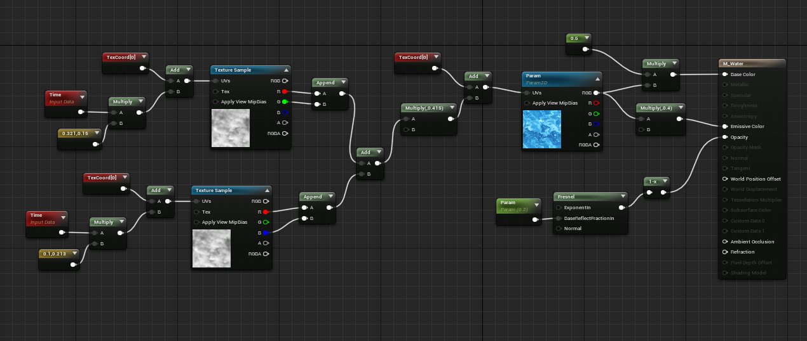
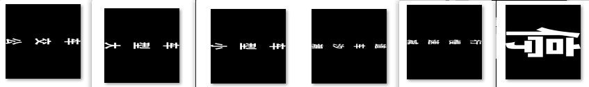

## 实习工作与学习记录
***
### 2021/06/11
1.添加工地、水泥塔、房屋等模型，制作相应材质，丰富场景。 
2.写脚本进行场景测试，录制测试效果视频。 

***
### 2021/06/10
1.新增路面标识贴花。 
2.调整道路不同路段的车道线分布。 

***
### 2021/06/09
1.制作广告牌、桥梁、新路牌、减速带的模型与材质。 

***
### 2021/06/08
1.添加加油站、防撞桶模型。 
2.重新布置道路，添加贴花与路牌元素。 

***
### 2021/06/07
布置场景四周植被。
***
### 2021/06/04
制作高压电塔，布置场景并调整细节。 

***
### 2021/06/03
完成闭环高速路段道路的初步搭建。 

### 2021/06/02
将京港澳高速路段重新修改成闭环状。 

### 2021/06/01
整理京港澳高速路段的环境素材。
***
### 2021/05/31
修改A1Q脚本。
***
### 2021/05/28
协助完成A1Q仿真视频所需的视频与脚本。
***
### 2021/05/27
对资产进行分类与重命名。

***
### 2021/05/26
提取和整理建筑物的蓝图、模型等资产。 

***
### 2021/05/25
进一步提取整理Carla的车辆与人物模型资产。 

***
### 2021/05/24
整理Carla的车辆美术资产。
***
### 2021/05/21
使用Blender制作一扇门的低模，记录下部分Blender的快捷键操作和修改器用途。 

***
### 2021/05/20
修改路沿仿真场景道路。 

***
### 2021/05/19
完成路沿仿真场景的坡道与弯道。 

***
### 2021/05/18
1.继续搜集道具模型。 
2.完成路沿仿真场景中的直道。 

***
### 2021/05/17
1.用数学节点的方式实现特效材质，原理为计算并提取出AxA矩阵贴图中每行每列的**单个**图像，然后逐帧跳转，其优点是可以调节帧率速度。 
PS:由于贴图背景为黑色，所以要将材质混合模式改为Translucent(半透明)，该材质可用于车辆中或道路上的一些动态图像的实现（局限：需要用到AxA矩阵贴图，且限于平面上）。

 
2.实现一个简单的水流材质。

***
### 2021/05/14
学习Python，尝试写脚本，并在UE4中运行。
***
### 2021/05/13
完成路面感知仿真场景Case10-18要求的道路。 

***
### 2021/05/12
完成坡道上道具元素的添加。 

***
### 2021/05/11
在直道与弯道上添加道具元素。 

***
### 2021/05/10
1.添加三种道路的路沿元素。 

路沿元素主要添加新样条线，为其主路赋透明材质，启用Spline Extra或者Mesh Extra完成路沿效果。如果启用Mesh Extra，在有样条线有弯曲时，模型会出现衔接问题，使得效果看起来像锯齿化；启用Spline Extra可以解决这一问题，但路面的透明材质会失效。具体效果如下图。 

2.制作路面文字标识贴图。 

***
### 2021/05/08
1.制作路面感知仿真场景所需道路。 
2.补充路面标识贴图。 

***
### 2021/05/07
制作场景元素材质，实现其在场景中的写实效果。 

***
### 2021/05/06
搜集和整理路面感知仿真场景所需道具元素。
***
### 2021/04/30
学习和摸索SpeedTree，实现树的效果。 

***
### 2021/04/29
1.修改贴图细节。 
2.在场景中实现道路效果。 
3.总结个人工作月报。 

***
### 2021/04/28
根据道路UV制作道路贴图。 

***
### 2021/04/27
1.修改分流道路模型。 
2.制作收窄与扩宽道路模型。 
3.制作道路的UV贴图。 

***
### 2021/04/26
1.制作路面磨损效果。 

2.制作分流道路模型。 

***
### 2021/04/25
完成14个道路标识贴图的绘制。 

***
### 2021/04/23
完成Carla官方文档**地图自定义工具**文档的要点记录，在**天气蓝图**这一小节中，调节了相应参数，但实现的效果不理想，出现了过度曝光问题，因而对这小节的总结记录不是很到位。
***
### 2021/04/22
完成Carla官方文档**材质定制**文档的要点记录，但在操作记录过程中，在**定制道路**这一小节出现了问题，没能顺利实现操作。
***
### 2021/04/21
熟悉Carla官方文档的**添加道具、材质定制**操作，记录文档要点。
***
### 2021/04/20
熟悉Carla官方文档的**添加车辆**操作，记录文档要点。
***
### 2021/04/19
成功编译Carla源码，熟悉官方文档的**地图提取**操作，记录文档要点。
***
### 2021/04/16
1.丰富京港澳高速路段场景细节。 

2.安装编译carla。 
3.使用普通材质简单实现了个假边缘发光效果，**角**的位置有待优化。 

***
### 2021/04/15
1.制作与修改路标贴图。 
2.制作收费站道路的简单模型。 

***
### 2021/04/14
制作25条所需的测试道路。 

***
### 2021/04/13
1.制作路牌材质，优化效果。 

2.继续扩充道路标志牌模型库。
***
### 2021/04/12
1.调整与优化收费站模型材质效果。 

2.收集道路标志牌模型，整理成库。 

***
### 2021/04/09
完成京港澳高速路段场景的初版。 

***
### 2021/04/08
布置京港澳高速路路段场景的环境。 

***
### 2021/04/07
搭建京港澳高速路段。 

***
### 2021/04/06
搭建京港澳高速路段隧道效果。 

***
### 2021/04/02
实现L3Test所需的模型材质效果。 

发现问题：在3dmax中，分离车身与轮子时，如果有两辆或两辆以上的车，在进行层级图解再导入UE4中，车身与车轮会**可能**会出现分开现象，无法变为整体。 
 
Tips:
1.大部分搅拌车，理论容积为10方，参考江苏极东搅拌车，其外型尺寸为(长×宽×高)(cm)：1050×249.6×390。 
2.奔驰sprinter车身尺寸为(长×宽×高)(cm)591x199.3x272。 
3.宝马x7的车身尺寸为(长×宽×高)(cm)516.3x200x183.5。 

***
### 2021/04/01
1.完善模型动画效果。 
2.修改模型蓝图。 
3.制作L3Test场景。 

***
### 2021/03/31
添加和调整人物模型的动画效果。
***
### 2021/03/30
1.完成所需模型的搜集。 
2.制作模型材质。 

***
### 2021/03/29
搜集模型并进行动作与骨骼重定向。
***
### 2021/03/26
1.为人物模型重新展UV贴图。 
 
2.调整人物模型的布料材质。 

***
### 2021/03/25
1.调整模型动作 
2.人物模型的材质制作 
遇到问题：在3dmax中，对模型使用镜像复制，法线容易出现翻转现象。
***
### 2021/03/24
1.完成假人3D模型。 
2.修改3D场景效果图。 

***
### 2021/03/23
1.制作假人3D模型。 
2.整理AirSime与Carla的场景测试元素文档。 
3.学习Python。
***
### 2021/03/22
1.完成停车3D效果图。 
2.修改新闻所需3D场景效果图。 
3.开始Python学习。
***
### 2021/03/19
1.协助设计组完成3D场景效果图。 
2.学习3D建模知识。
***
### 2021/03/18
1.熟悉AirSim与Carla中的场景测试环境元素，进行分类记录。 
2.在编译carla源码过程中，出现了以下问题： 

解决方法：https://www.cnblogs.com/qq2806933146xiaobai/p/13359446.html 
接着会出现以下问题 

***
### 2021/03/17
解决编码工具问题，编译UE4源码与carla源码。 
遇到问题:carla源码在构建到"编译PythonAPI客户端"这一步卡住了。 

↑原因分析：没安装python，导致无法编译PythonAPI
***
### 2021/03/16
1.下载UE4源码并编译。 
2.编译carla源码。 
3.熟悉AirSim里的场景。 
4.学习C++知识。
***
### 2021/03/15
1.摸索SnappyRoad每种功能的使用和基础操作，并制作出相关的路口效果。 
2.学习交通道路标识知识。 
3.使用AirSim与Carla，总结出这两个场景库中的测试环境要素，进行分类并记录。
***
### 2021/03/12
请假...
***
### 2021/03/11
1.完成新闻所需效果图。 
2.学习SnappyRoad插件，制作十字路口场景模型。 
3.学习UE4材质节点与Unity Shader。
***
### 2021/03/10
1.协助设计组制作新闻所需效果图。 
2.学习UE4渐变材质与图形绘制知识。
***
### 2021/03/09
1.完成路口场景效果图。 
2.学习《写实绘画与3D渲染》，理解场景技法与计算机图形学基础知识。 
3.阅读《中国自动驾驶仿真蓝皮书》与《自动驾驶仿真发展与展望》。
***
### 2021/03/08
1.修改路口3D场景的车辆材质。 
2.调整场景灯光氛围。 
3.学习UE4渐变材质效果的实现。
***
### 2021/03/05
1.调整人物模型动作，更换汽车模型。 
2.调整聚光效果和场景光照效果。 
3.导出最后效果交给设计组。
***
### 2021/03/04
1.修改人物模型网格材质。 
2.为人物添加骨骼动作，并进行重定向。
***
### 2021/03/03
实现人物网格材质。
***
### 2021/03/02
1.协助设计组，修改3D场景的车漆材质。 
2.协助设计组，修改官网所需的宣传人物和汽车材质。
***
### 2021/03/01
1.通过蓝图了解车辆模型在UE4中的运动步骤。 
2.协助设计组完成3D场景的修改。
***
### 2021/02/28
1.安装所需软件。 
2.熟悉githun、gitlab使用以及了解大致的工作流程。 
3.读懂Vehicle轮式载具项目。
