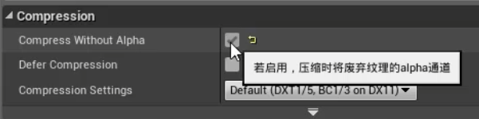

# UE4日常学习笔记
记录在学习UE4过程中的知识点、原理、遇到的问题、解决方法以及个人理解与心得。
**PS:在打包时候如果提示未知错误，可先将“输出日志”里提示出错的蓝图进行节点刷新与编译，删除“save”文件夹后再重新打开项目进行打包。**
[TOC]
## 问题及解决方法
1.当一个模型拥有多套UV时，可通过`TexCoord`节点的坐标索引来定位到相配套的UV。 

完成材质这一步，保存并应用，即可让模型使用正确的UV。(懒得放图了...)
## 材质原理与节点
#### 原理：
- 所有导入到UE4中的纹理都会被压缩，在**压缩率**与**分辨率**相同的情况下，图像大小相等。尽可能使用`.psd`、`.tga`等压缩率较小或没有压缩过的纹理，能够保证纹理图像的质量。
- **RGB混合纹理的制作**：在PS中选择"通道"，打开右上角的菜单，选择"分离通道"即可得到R、G、B三个通道，随后将图片放置到想到保存的通道中，合并可见图层，返回到"通道"中，打开菜单，点击"合并通道"，选择"RGB颜色"，最后得到自定义的RGB混合纹理贴图。

`tip:关于sRGB与伽马矫正，由于人眼对亮度的感知并非线性，而摄像机或图像图里程序是线性感光、工作流，所以它们最终会对图像进行一次Gamma矫正，以还原人眼效果，换句话说，颜色贴图是给人看的，粗糙度、金属度、AO（环境光遮蔽）等灰度纹理是给机器看的，所以具有灰度信息的纹理贴图需要取消掉sRGB，以获取准确的灰度信息，还原正确效果。`
- Alpha通道在UE4中的压缩率比较低，会增加纹理图像的压缩大小，所以尽量别在Alpha通道中存放一些重要的纹理信息，可以在图像细节面板中勾选"`Compress Without Alpha`舍弃掉Alpha通道。 

- 计算遮蔽关系——剔除消耗：距离剔除（消耗最少，需要手动设置）<视锥剔除<遮蔽剔除。
  1. 距离剔除的消耗最低剔除方式，在剔除渲染中最先被计算；  
  2. 深度检测，判断物体之间重叠部分像素的前后关系，剔除靠后的像素
  3. 半透明材质在出现渲染排序问题时，可以在引擎→物体细节面板里设置物体的渲染优先级，强制其进行先后排序，但类似于进行旋转角度的操作时会穿帮，所以强制修改渲染优先级并不能解决一些实际问题，还是得视情况而定。

***
#### 节点：
- 归一化(Normalize)：把任何与他相连的向量值都变为单位向量，但**方向**不变。
- (Staurate)：**等比例**压缩输入的数值，输出0-1范围的数值。
- 钳制(Clamp)：只保留0-1范围内的值，其余的值全抛弃。
- 低成本对比度(CheapContrast)：类似于在Photoshop中应用色阶调整，以及将黑色和白色标志拉入到一个位中。可控制提升对比度的程度。
***
## 材质类型
***
#### 积雪材质
PS：该材质的制作方法、原理出自B站up主：[黑鸟云端的教程](https://www.bilibili.com/video/BV1TJ411p7U9/?spm_id_from=333.788.videocard.2)；[教程补充](https://www.bilibili.com/video/BV1M7411L77s) 
在现实世界中，积雪一般生成在物体的水平顶面、斜立面等有承载空间的面上，所以要考虑把这些面区分出来。 
 
使用`VertexNormal`与`dot`，区分出Z轴方向法线与它的朝向，再用`Lerp`约束一下范围。 
 
***
##