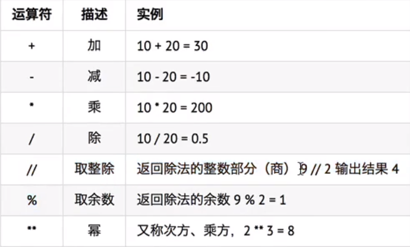

# Python日常学习笔记
记录在学习Python过程中的知识点、原理、个人理解以及心得。
[TOC]
### Python的解释器
1.使用 Python3.x 解释器 
Python3  xxx . py 
2.其他语言实现的Python解释器： 
 - CPython————官方版本的C语言实现
 - JPython————可以运行在Java平台
 - IronPython————可以运行在.NET和Mono平台
 - PyPy————Python实现的，支持JIT即时编译

3.‘#’为单行注释字符。可单独注释，也可在单行代码后进行注释，如需在代码后进行注释，建议与代码保留两个空格的位置,提高可读性。 
4.要在Python程序中使用多行注释，可以用**一对连续的三个引号**(单引号和双引号都可以)。 
**5.Python中的算数运算符**

