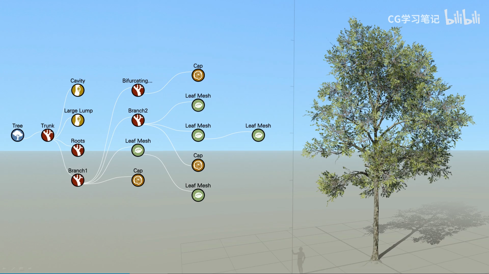
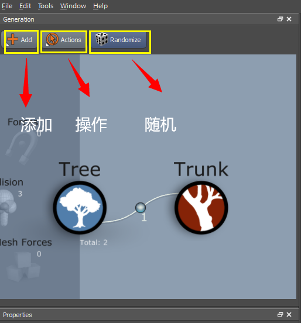
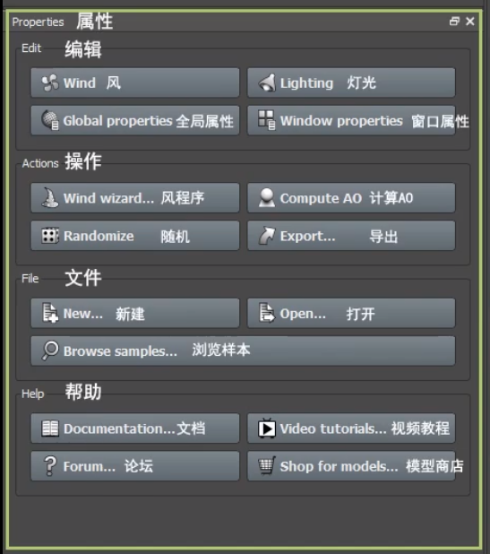

## 开一个SpeedTree的笔记坑。
***
学习资料视频源于B站Up:CG学习笔记[UE4零基础入门到独立游戏开发系列【SpeedTree基础操作面板和参数讲解】](https://www.bilibili.com/video/BV1R741157mD?p=3&spm_id_from=pageDriver)
该视频主要介绍基础操作面板与参数 
本坑记录在学习和操作SpeedTree的一些心得理解。 
***
[Toc]
#### 1.基础操作
- 左键——旋转视图
- 中键/Alt+左键——平移视图
- 右键——打开菜单
- 滚轮——缩放视图

一棵树制作的基础流程节点网络如下图

#### 界面功能介绍

