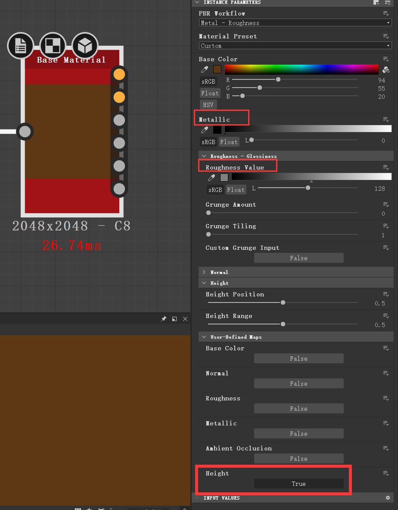
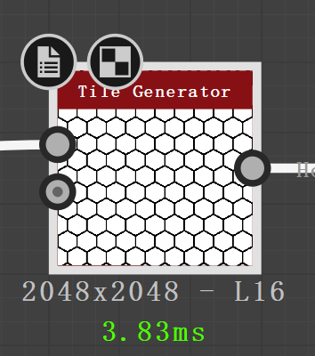
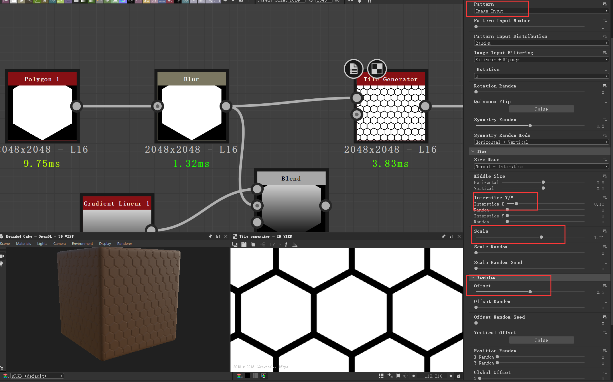
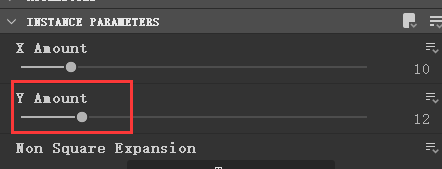
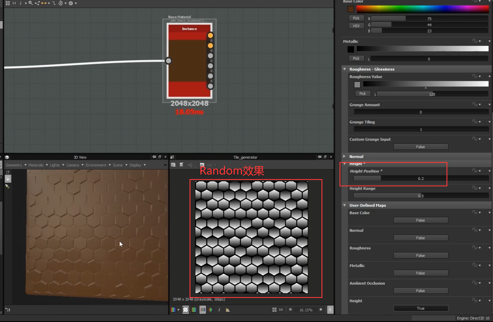

#Substance Designer学习笔记
***
[TOC]
### 操作与快捷键
- Tab/空格：打开节点搜索面板
***
### 节点属性
- Bulr：模糊（调整边缘锐化度）
- Blend：混合
- Gradient Linear：线性渐变
- Warp：扭曲
- Level：调节明暗对比度
***
### 案例练习
以下案例练习是观看B站教程视频所做，由于笔者用的是2021版的SD，属性、节点等与教程版本中有出入的部分，会特别标明。[教程戳这里](https://www.bilibili.com/video/BV1zW411V7ZH?from=search&seid=68794443328249831)
#### 案例1 地砖（多图提醒）
*该案例中阐述了SD的工作原理：高度 →基础颜色 →粗糙度*
1. 新建`Base Material`节点用以预览效果，激活高度图，调整Metallic与Roughness的值。由于地砖没有金属质感，所以Metallic的值直接调0。 
 
2. 新建`Tile Generator`节点，将Pattern(图案)改为Image Input，连至base material。 
 
3. 在`Tile Generator`前添加一个Polygon1的图形，在二者之间新建一个`Blur（模糊）`节点，调整Blur的Intensity值，让图形边缘模糊一些，降低地砖边缘的锐化值。连至`Tile Generator`并选择`Tile Genrator`，调整其`Size Scale、Offset、Interstice X/Y（X/Y轴裂缝大小）`，让地砖图案分布看起来比较规则。 
 
    调好值后，可根据需要调整`Number Y`(2021版改为`Y Amount`)，增加/减少图形在Y轴上的分布。 
 
4. 新建`Blend`节点、`Gradient Linear1（线性渐变）`并连接，在`3D View`窗口中，点开`Material`中的`Edit`，调节`Material：Height`的值激活材质高度。  
    >教程中Height的值为0.5，该高度值方便与Substance Painter进行对接。**在2021版本中想达到同样效果，需将值改为5**。

   回到`Tile Generator`中，选择`Fixed Rotation Random（固定随机旋转）`将值调为0.5（可根据喜好调值）。**2021版本中该属性改名为`Symmetry Random（随机对称）`**。点击`Base Material`，在`Height`里调整`Height Position`的值，使得地砖高度更为自然合理。 
 
5. 新建`Warp（扭曲）`节点，选择合适的`Noise图（教程里用的Perlin Noise Zoom）`，目的是让利用扭曲让地砖边缘具有磨损效果。*（现实生活中的地砖随时间推移产生磨损）*
